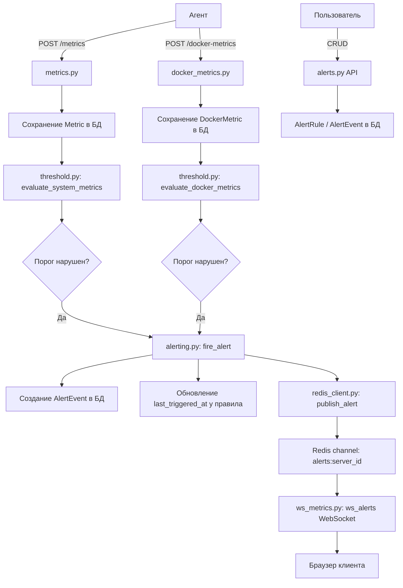
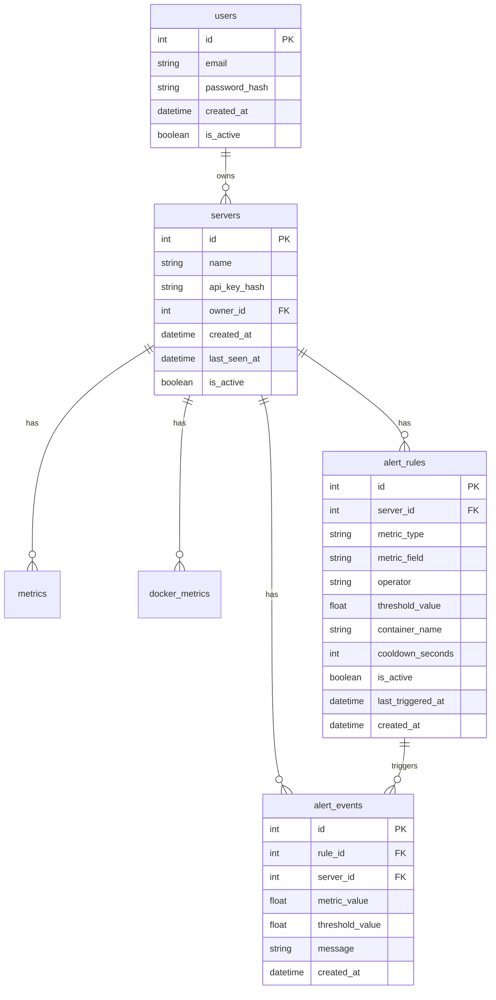

# Stage 5 — Alerting: Детальный план

## Обзор

Stage 5 добавляет систему алертов в PulseWatch: пользователи создают пороговые правила привязанные к серверу, входящие метрики проверяются на нарушение порогов синхронно при приёме, срабатывания логируются как AlertEvent, а real-time уведомления доставляются через Redis Pub/Sub + WebSocket.

---

## 1. Архитектурная диаграмма



---

## 2. Модели БД

### 2.1 AlertRule — `app/models/alert_rule.py`

Правило порогового алерта, привязанное к серверу.

| Поле | Тип | Ограничения | Описание |
|------|-----|-------------|----------|
| `id` | `int` | PK, autoincrement | |
| `server_id` | `int` | FK → `servers.id`, NOT NULL | Целевой сервер |
| `metric_type` | `str` | NOT NULL | Тип метрики: `system` или `docker` |
| `metric_field` | `str` | NOT NULL | Поле для проверки: `cpu_percent`, `memory_percent`, `disk_percent`, `memory_usage_mb` |
| `operator` | `str` | NOT NULL | Оператор сравнения: `gt`, `gte`, `lt`, `lte`, `eq`, `neq` |
| `threshold_value` | `float` | NOT NULL | Пороговое значение |
| `container_name` | `str \| None` | NULLable | Для docker-правил: фильтр по контейнеру. NULL = все контейнеры |
| `cooldown_seconds` | `int` | NOT NULL, default=300 | Минимальный интервал между повторными алертами |
| `is_active` | `bool` | NOT NULL, default=True | Включено/выключено |
| `last_triggered_at` | `datetime \| None` | NULLable, DateTime с tz | Время последнего срабатывания |
| `created_at` | `datetime` | NOT NULL, server_default=now | |

**Индексы:**
- `ix_alert_rules_server_id` на `server_id` — быстрый поиск правил при приёме метрик
- `ix_alert_rules_server_id_metric_type` на `(server_id, metric_type, is_active)` — оптимизация запроса активных правил

**Допустимые значения `metric_field` по `metric_type`:**
- `system`: `cpu_percent`, `memory_percent`, `disk_percent`
- `docker`: `cpu_percent`, `memory_usage_mb`

```python
# app/models/alert_rule.py
from datetime import datetime
from sqlalchemy import Boolean, DateTime, ForeignKey, Index, Integer, String, func
from sqlalchemy.orm import Mapped, mapped_column
from app.database import Base


class AlertRule(Base):
    __tablename__ = "alert_rules"

    id: Mapped[int] = mapped_column(primary_key=True)
    server_id: Mapped[int] = mapped_column(ForeignKey("servers.id"))
    metric_type: Mapped[str] = mapped_column(String(20))      # "system" | "docker"
    metric_field: Mapped[str] = mapped_column(String(50))      # "cpu_percent" | ...
    operator: Mapped[str] = mapped_column(String(5))           # "gt" | "gte" | ...
    threshold_value: Mapped[float]
    container_name: Mapped[str | None] = mapped_column(String(255), nullable=True)
    cooldown_seconds: Mapped[int] = mapped_column(Integer, default=300)
    is_active: Mapped[bool] = mapped_column(Boolean, default=True, server_default="true")
    last_triggered_at: Mapped[datetime | None] = mapped_column(DateTime(timezone=True), nullable=True)
    created_at: Mapped[datetime] = mapped_column(
        DateTime(timezone=True), server_default=func.now()
    )

    __table_args__ = (
        Index("ix_alert_rules_server_active", "server_id", "metric_type", "is_active"),
    )
```

### 2.2 AlertEvent — `app/models/alert_event.py`

Лог срабатывания алерта.

| Поле | Тип | Ограничения | Описание |
|------|-----|-------------|----------|
| `id` | `int` | PK, autoincrement | |
| `rule_id` | `int` | FK → `alert_rules.id`, NOT NULL | Сработавшее правило |
| `server_id` | `int` | FK → `servers.id`, NOT NULL | Сервер |
| `metric_value` | `float` | NOT NULL | Фактическое значение метрики |
| `threshold_value` | `float` | NOT NULL | Порог из правила на момент срабатывания |
| `message` | `str` | NOT NULL | Человекочитаемое описание |
| `created_at` | `datetime` | NOT NULL, server_default=now | |

**Индексы:**
- `ix_alert_events_rule_id` на `rule_id`
- `ix_alert_events_server_id_created_at` на `(server_id, created_at)` — быстрый список событий по серверу

```python
# app/models/alert_event.py
from datetime import datetime
from sqlalchemy import DateTime, ForeignKey, Index, func
from sqlalchemy.orm import Mapped, mapped_column
from app.database import Base


class AlertEvent(Base):
    __tablename__ = "alert_events"

    id: Mapped[int] = mapped_column(primary_key=True)
    rule_id: Mapped[int] = mapped_column(ForeignKey("alert_rules.id"))
    server_id: Mapped[int] = mapped_column(ForeignKey("servers.id"))
    metric_value: Mapped[float]
    threshold_value: Mapped[float]
    message: Mapped[str]
    created_at: Mapped[datetime] = mapped_column(
        DateTime(timezone=True), server_default=func.now()
    )

    __table_args__ = (
        Index("ix_alert_events_server_created", "server_id", "created_at"),
    )
```

### ER-диаграмма



---

## 3. Pydantic-схемы

Новый файл `app/schemas/alert.py`:

```python
from datetime import datetime
from enum import Enum
from pydantic import BaseModel, ConfigDict, Field


# --- Enums ---

class MetricType(str, Enum):
    SYSTEM = "system"
    DOCKER = "docker"

class MetricField(str, Enum):
    CPU_PERCENT = "cpu_percent"
    MEMORY_PERCENT = "memory_percent"
    DISK_PERCENT = "disk_percent"
    MEMORY_USAGE_MB = "memory_usage_mb"

class ComparisonOperator(str, Enum):
    GT = "gt"
    GTE = "gte"
    LT = "lt"
    LTE = "lte"
    EQ = "eq"
    NEQ = "neq"


# --- AlertRule schemas ---

class AlertRuleCreate(BaseModel):
    server_id: int
    metric_type: MetricType
    metric_field: MetricField
    operator: ComparisonOperator
    threshold_value: float
    container_name: str | None = None
    cooldown_seconds: int = Field(default=300, ge=0)

class AlertRuleUpdate(BaseModel):
    metric_field: MetricField | None = None
    operator: ComparisonOperator | None = None
    threshold_value: float | None = None
    container_name: str | None = None
    cooldown_seconds: int | None = Field(default=None, ge=0)
    is_active: bool | None = None

class AlertRuleRead(BaseModel):
    id: int
    server_id: int
    metric_type: str
    metric_field: str
    operator: str
    threshold_value: float
    container_name: str | None
    cooldown_seconds: int
    is_active: bool
    last_triggered_at: datetime | None
    created_at: datetime

    model_config = ConfigDict(from_attributes=True)


# --- AlertEvent schemas ---

class AlertEventRead(BaseModel):
    id: int
    rule_id: int
    server_id: int
    metric_value: float
    threshold_value: float
    message: str
    created_at: datetime

    model_config = ConfigDict(from_attributes=True)


# --- Validation helper ---

SYSTEM_FIELDS = {MetricField.CPU_PERCENT, MetricField.MEMORY_PERCENT, MetricField.DISK_PERCENT}
DOCKER_FIELDS = {MetricField.CPU_PERCENT, MetricField.MEMORY_USAGE_MB}
```

> **Примечание:** Валидация `metric_field` ↔ `metric_type` и `container_name` ↔ `metric_type` выполняется на уровне API-эндпоинта.

---

## 4. Threshold Evaluation Logic — `app/services/threshold.py`

Сервис проверки порогов. Вызывается синхронно при приёме метрик.

```python
# app/services/threshold.py
from datetime import datetime, timedelta, timezone
from sqlalchemy import select
from sqlalchemy.ext.asyncio import AsyncSession

from app.models.alert_rule import AlertRule
from app.models.metric import Metric
from app.models.docker_metric import DockerMetric
from app.services.alerting import fire_alert


async def evaluate_system_metrics(
    metric: Metric,
    db: AsyncSession,
) -> None:
    """
    Проверяет системную метрику на нарушение пороговых правил.
    Вызывается после сохранения Metric в БД.
    """
    rules = await _get_active_rules(db, metric.server_id, "system")
    
    field_map = {
        "cpu_percent": metric.cpu_percent,
        "memory_percent": metric.memory_percent,
        "disk_percent": metric.disk_percent,
    }
    
    for rule in rules:
        value = field_map.get(rule.metric_field)
        if value is None:
            continue
        if _is_triggered(value, rule.operator, rule.threshold_value):
            if await _check_cooldown(rule):
                await fire_alert(
                    rule=rule,
                    server_id=metric.server_id,
                    metric_value=value,
                    db=db,
                )


async def evaluate_docker_metrics(
    docker_metric: DockerMetric,
    db: AsyncSession,
) -> None:
    """
    Проверяет Docker-метрику на нарушение пороговых правил.
    Вызывается после сохранения DockerMetric в БД.
    """
    rules = await _get_active_rules(db, docker_metric.server_id, "docker")
    
    field_map = {
        "cpu_percent": docker_metric.cpu_percent,
        "memory_usage_mb": docker_metric.memory_usage_mb,
    }
    
    for rule in rules:
        # Фильтр по container_name
        if rule.container_name is not None and rule.container_name != docker_metric.container_name:
            continue
        
        value = field_map.get(rule.metric_field)
        if value is None:
            continue
        if _is_triggered(value, rule.operator, rule.threshold_value):
            if await _check_cooldown(rule):
                await fire_alert(
                    rule=rule,
                    server_id=docker_metric.server_id,
                    metric_value=value,
                    db=db,
                )


async def _get_active_rules(
    db: AsyncSession, server_id: int, metric_type: str
) -> list[AlertRule]:
    """Загружает активные правила для сервера и типа метрики."""
    result = await db.execute(
        select(AlertRule).where(
            AlertRule.server_id == server_id,
            AlertRule.metric_type == metric_type,
            AlertRule.is_active == True,
        )
    )
    return list(result.scalars().all())


def _is_triggered(value: float, operator: str, threshold: float) -> bool:
    """Проверяет, нарушен ли порог."""
    ops = {
        "gt": lambda v, t: v > t,
        "gte": lambda v, t: v >= t,
        "lt": lambda v, t: v < t,
        "lte": lambda v, t: v <= t,
        "eq": lambda v, t: v == t,
        "neq": lambda v, t: v != t,
    }
    check = ops.get(operator)
    return check(value, threshold) if check else False


async def _check_cooldown(rule: AlertRule) -> bool:
    """Проверяет, прошёл ли cooldown с последнего срабатывания."""
    if rule.last_triggered_at is None:
        return True
    now = datetime.now(timezone.utc)
    cooldown = timedelta(seconds=rule.cooldown_seconds)
    return now - rule.last_triggered_at >= cooldown
```

---

## 5. Alerting Service — `app/services/alerting.py`

Создание AlertEvent + обновление правила + публикация в Redis.

```python
# app/services/alerting.py
from sqlalchemy.ext.asyncio import AsyncSession

from app.models.alert_rule import AlertRule
from app.models.alert_event import AlertEvent
from app.redis_client import publish_alert


async def fire_alert(
    rule: AlertRule,
    server_id: int,
    metric_value: float,
    db: AsyncSession,
) -> None:
    """
    Создаёт AlertEvent, обновляет last_triggered_at у правила,
    публикует уведомление в Redis Pub/Sub.
    """
    message = (
        f"Alert: {rule.metric_field} value {metric_value} "
        f"{rule.operator} {rule.threshold_value} "
        f"on server {server_id}"
    )
    
    event = AlertEvent(
        rule_id=rule.id,
        server_id=server_id,
        metric_value=metric_value,
        threshold_value=rule.threshold_value,
        message=message,
    )
    db.add(event)
    
    rule.last_triggered_at = __import__("datetime").datetime.now(
        __import__("datetime").timezone.utc
    )
    
    await db.commit()
    await db.refresh(event)
    
    # Публикуем в Redis (best-effort)
    try:
        await publish_alert(
            server_id=server_id,
            data={
                "event_id": event.id,
                "rule_id": rule.id,
                "metric_field": rule.metric_field,
                "metric_value": metric_value,
                "threshold_value": rule.threshold_value,
                "operator": rule.operator,
                "message": message,
                "created_at": event.created_at.isoformat(),
            },
        )
    except Exception:
        pass  # Pub/Sub failure не должен блокировать
```

---

## 6. API-эндпоинты — `app/api/alerts.py`

### 6.1 Сигнатуры эндпоинтов

| Метод | Путь | Описание | Auth |
|-------|------|----------|------|
| `POST` | `/alerts/rules` | Создать правило алерта | JWT |
| `GET` | `/alerts/rules` | Список правил пользователя | JWT |
| `GET` | `/alerts/rules/{rule_id}` | Получить правило по ID | JWT + owner |
| `PUT` | `/alerts/rules/{rule_id}` | Обновить правило | JWT + owner |
| `DELETE` | `/alerts/rules/{rule_id}` | Удалить правило | JWT + owner |
| `GET` | `/alerts/events` | Список событий пользователя | JWT |
| `GET` | `/alerts/events/server/{server_id}` | События по серверу | JWT + owner |

### 6.2 Детализация

```python
# app/api/alerts.py
from fastapi import APIRouter, Depends, HTTPException, Query, status
from sqlalchemy import select
from sqlalchemy.ext.asyncio import AsyncSession

from app.api.deps import get_current_user
from app.database import get_db
from app.models.user import User
from app.models.server import Server
from app.models.alert_rule import AlertRule
from app.models.alert_event import AlertEvent
from app.schemas.alert import (
    AlertRuleCreate, AlertRuleUpdate, AlertRuleRead,
    AlertEventRead, MetricType, MetricField,
    SYSTEM_FIELDS, DOCKER_FIELDS,
)

router = APIRouter()


async def _verify_server_ownership(server_id: int, user: User, db: AsyncSession) -> Server:
    """Проверяет, что сервер принадлежит пользователю."""
    server = (await db.execute(
        select(Server).where(Server.id == server_id, Server.owner_id == user.id)
    )).scalar_one_or_none()
    if server is None:
        raise HTTPException(status_code=404, detail="Server not found")
    return server


async def _verify_rule_ownership(rule_id: int, user: User, db: AsyncSession) -> AlertRule:
    """Проверяет, что правило принадлежит серверу пользователя."""
    rule = (await db.execute(
        select(AlertRule).join(Server).where(
            AlertRule.id == rule_id, Server.owner_id == user.id
        )
    )).scalar_one_or_none()
    if rule is None:
        raise HTTPException(status_code=404, detail="Alert rule not found")
    return rule


@router.post("/rules", response_model=AlertRuleRead, status_code=status.HTTP_201_CREATED)
async def create_alert_rule(
    data: AlertRuleCreate,
    current_user: User = Depends(get_current_user),
    db: AsyncSession = Depends(get_db),
):
    """Создаёт правило алерта."""
    # Проверка владения сервером
    await _verify_server_ownership(data.server_id, current_user, db)
    
    # Валидация metric_field ↔ metric_type
    if data.metric_type == MetricType.SYSTEM:
        if data.metric_field not in SYSTEM_FIELDS:
            raise HTTPException(400, detail=f"Field {data.metric_field} not valid for system metrics")
        if data.container_name is not None:
            raise HTTPException(400, detail="container_name is only for docker metric rules")
    elif data.metric_type == MetricType.DOCKER:
        if data.metric_field not in DOCKER_FIELDS:
            raise HTTPException(400, detail=f"Field {data.metric_field} not valid for docker metrics")
    
    rule = AlertRule(
        server_id=data.server_id,
        metric_type=data.metric_type.value,
        metric_field=data.metric_field.value,
        operator=data.operator.value,
        threshold_value=data.threshold_value,
        container_name=data.container_name,
        cooldown_seconds=data.cooldown_seconds,
    )
    db.add(rule)
    await db.commit()
    await db.refresh(rule)
    return rule


@router.get("/rules", response_model=list[AlertRuleRead])
async def list_alert_rules(
    server_id: int | None = Query(default=None),
    current_user: User = Depends(get_current_user),
    db: AsyncSession = Depends(get_db),
):
    """Список правил. Опционально фильтруется по server_id."""
    query = (
        select(AlertRule)
        .join(Server)
        .where(Server.owner_id == current_user.id)
    )
    if server_id is not None:
        query = query.where(AlertRule.server_id == server_id)
    result = await db.execute(query.order_by(AlertRule.created_at.desc()))
    return result.scalars().all()


@router.get("/rules/{rule_id}", response_model=AlertRuleRead)
async def get_alert_rule(
    rule_id: int,
    current_user: User = Depends(get_current_user),
    db: AsyncSession = Depends(get_db),
):
    rule = await _verify_rule_ownership(rule_id, current_user, db)
    return rule


@router.put("/rules/{rule_id}", response_model=AlertRuleRead)
async def update_alert_rule(
    rule_id: int,
    data: AlertRuleUpdate,
    current_user: User = Depends(get_current_user),
    db: AsyncSession = Depends(get_db),
):
    rule = await _verify_rule_ownership(rule_id, current_user, db)
    update_data = data.model_dump(exclude_unset=True)
    for field, value in update_data.items():
        setattr(rule, field, value)
    await db.commit()
    await db.refresh(rule)
    return rule


@router.delete("/rules/{rule_id}", status_code=status.HTTP_204_NO_CONTENT)
async def delete_alert_rule(
    rule_id: int,
    current_user: User = Depends(get_current_user),
    db: AsyncSession = Depends(get_db),
):
    rule = await _verify_rule_ownership(rule_id, current_user, db)
    await db.delete(rule)
    await db.commit()


@router.get("/events", response_model=list[AlertEventRead])
async def list_alert_events(
    server_id: int | None = Query(default=None),
    limit: int = Query(default=100, ge=1, le=1000),
    current_user: User = Depends(get_current_user),
    db: AsyncSession = Depends(get_db),
):
    """Список событий алертов. Опционально фильтруется по server_id."""
    query = (
        select(AlertEvent)
        .join(Server)
        .where(Server.owner_id == current_user.id)
    )
    if server_id is not None:
        query = query.where(AlertEvent.server_id == server_id)
    query = query.order_by(AlertEvent.created_at.desc()).limit(limit)
    result = await db.execute(query)
    return result.scalars().all()


@router.get("/events/server/{server_id}", response_model=list[AlertEventRead])
async def list_server_alert_events(
    server_id: int,
    limit: int = Query(default=100, ge=1, le=1000),
    current_user: User = Depends(get_current_user),
    db: AsyncSession = Depends(get_db),
):
    """События алертов для конкретного сервера."""
    await _verify_server_ownership(server_id, current_user, db)
    result = await db.execute(
        select(AlertEvent)
        .where(AlertEvent.server_id == server_id)
        .order_by(AlertEvent.created_at.desc())
        .limit(limit)
    )
    return result.scalars().all()
```

---

## 7. Точки интеграции

### 7.1 `app/api/metrics.py`

Добавить вызов `evaluate_system_metrics` после сохранения метрики, **после `db.commit()`**, но **до** `publish_metric`:

```python
# После await db.commit() и await db.refresh(new_metric)
# Добавить:
from app.services.threshold import evaluate_system_metrics

try:
    await evaluate_system_metrics(new_metric, db)
except Exception:
    pass  # Threshold failure не должен блокировать приём метрик
```

### 7.2 `app/api/docker_metrics.py`

Добавить вызов `evaluate_docker_metrics` для каждой DockerMetric:

```python
# После await db.commit()
# Добавить:
from app.services.threshold import evaluate_docker_metrics

for row in rows:
    try:
        await evaluate_docker_metrics(row, db)
    except Exception:
        pass  # Threshold failure не должен блокировать
```

### 7.3 `app/redis_client.py`

Добавить функцию `publish_alert`:

```python
async def publish_alert(server_id: int, data: dict) -> None:
    """Публикует алерт в Redis-канал alerts:{server_id}."""
    r = _get_app_redis()
    payload = json.dumps({"type": "alert", "server_id": server_id, **data})
    await r.publish(f"alerts:{server_id}", payload)
```

### 7.4 `app/api/ws_metrics.py`

Добавить новый WebSocket-эндпоинт для real-time алертов:

```python
@router.websocket("/ws/alerts/{server_id}")
async def ws_alerts(
    websocket: WebSocket,
    server_id: int,
    token: str | None = Query(default=None),
    db: AsyncSession = Depends(get_db),
) -> None:
    """
    WebSocket для real-time уведомлений об алертах.
    Клиент подписывается на Redis-канал alerts:{server_id}.
    """
    await _ws_subscribe(websocket, server_id, token, "alerts", db)
```

### 7.5 `app/main.py`

Зарегистрировать роутер алертов:

```python
from app.api.alerts import router as alerts_router
# ...
app.include_router(alerts_router, prefix="/alerts", tags=["alerts"])
```

### 7.6 `tests/conftest.py`

Добавить импорты новых моделей для регистрации в `Base.metadata`:

```python
from app.models.alert_rule import AlertRule  # noqa: F401
from app.models.alert_event import AlertEvent  # noqa: F401
```

---

## 8. Миграция Alembic

Создать миграцию `create_alert_rules_and_alert_events_tables.py`:

```python
"""create alert_rules and alert_events tables

Revision ID: xxx
Revises: ffd0de8ef6dc
Create Date: 2026-05-04
"""
from alembic import op
import sqlalchemy as sa


def upgrade() -> None:
    op.create_table(
        "alert_rules",
        sa.Column("id", sa.Integer(), autoincrement=True, nullable=False),
        sa.Column("server_id", sa.Integer(), nullable=False),
        sa.Column("metric_type", sa.String(20), nullable=False),
        sa.Column("metric_field", sa.String(50), nullable=False),
        sa.Column("operator", sa.String(5), nullable=False),
        sa.Column("threshold_value", sa.Float(), nullable=False),
        sa.Column("container_name", sa.String(255), nullable=True),
        sa.Column("cooldown_seconds", sa.Integer(), nullable=False, server_default="300"),
        sa.Column("is_active", sa.Boolean(), nullable=False, server_default="true"),
        sa.Column("last_triggered_at", sa.DateTime(timezone=True), nullable=True),
        sa.Column("created_at", sa.DateTime(timezone=True), server_default=sa.func.now(), nullable=False),
        sa.ForeignKeyConstraint(["server_id"], ["servers.id"]),
        sa.PrimaryKeyConstraint("id"),
    )
    op.create_index(
        "ix_alert_rules_server_active", "alert_rules",
        ["server_id", "metric_type", "is_active"],
    )

    op.create_table(
        "alert_events",
        sa.Column("id", sa.Integer(), autoincrement=True, nullable=False),
        sa.Column("rule_id", sa.Integer(), nullable=False),
        sa.Column("server_id", sa.Integer(), nullable=False),
        sa.Column("metric_value", sa.Float(), nullable=False),
        sa.Column("threshold_value", sa.Float(), nullable=False),
        sa.Column("message", sa.String(), nullable=False),
        sa.Column("created_at", sa.DateTime(timezone=True), server_default=sa.func.now(), nullable=False),
        sa.ForeignKeyConstraint(["rule_id"], ["alert_rules.id"]),
        sa.ForeignKeyConstraint(["server_id"], ["servers.id"]),
        sa.PrimaryKeyConstraint("id"),
    )
    op.create_index(
        "ix_alert_events_server_created", "alert_events",
        ["server_id", "created_at"],
    )


def downgrade() -> None:
    op.drop_table("alert_events")
    op.drop_table("alert_rules")
```

---

## 9. План тестов — `tests/test_alerts.py`

### 9.1 Фикстуры

- `server_with_key` — переиспользуем существующую из `tests/test_metrics.py` или поднимаем в `conftest.py`
- `alert_rule_data` — данные для создания правила

### 9.2 Тест-кейсы

**CRUD правил алертов:**
1. `test_create_alert_rule_system` — создать системное правило, 201
2. `test_create_alert_rule_docker` — создать docker-правило, 201
3. `test_create_alert_rule_docker_with_container` — docker-правило с container_name
4. `test_create_alert_rule_invalid_field_for_type` — невалидный metric_field для metric_type, 400
5. `test_create_alert_rule_container_name_for_system` — container_name для system типа, 400
6. `test_create_alert_rule_server_not_found` — несуществующий сервер, 404
7. `test_create_alert_rule_unauthorized` — без токена, 401
8. `test_list_alert_rules` — список правил пользователя
9. `test_list_alert_rules_filter_by_server` — фильтр по server_id
10. `test_get_alert_rule` — получить правило по ID
11. `test_get_alert_rule_not_found` — несуществующее правило, 404
12. `test_get_alert_rule_other_user` — чужое правило, 404
13. `test_update_alert_rule` — обновить порог
14. `test_update_alert_rule_toggle_active` — выключить правило
15. `test_delete_alert_rule` — удалить правило, 204
16. `test_delete_alert_rule_not_found` — несуществующее, 404

**Threshold evaluation:**
17. `test_system_metric_triggers_alert` — отправить метрику с превышением порога → алерт создаётся
18. `test_system_metric_no_trigger` — метрика в пределах нормы → алерта нет
19. `test_docker_metric_triggers_alert` — docker-метрика с превышением
20. `test_docker_metric_container_filter` — правило с container_name, срабатывает только для нужного контейнера
21. `test_alert_cooldown` — повторная метрика в пределах cooldown → алерт не создаётся
22. `test_alert_cooldown_expired` — после истечения cooldown → алерт создаётся
23. `test_disabled_rule_no_alert` — is_active=False → алерта нет
24. `test_multiple_rules_same_metric` — несколько правил, срабатывают независимо

**Alert events:**
25. `test_list_alert_events` — список событий
26. `test_list_alert_events_filter_server` — фильтр по серверу
27. `test_list_alert_events_server_endpoint` — endpoint `/events/server/{id}`

---

## 10. Сводка файлов для создания/изменения

### Новые файлы — заполнить заглушки

| Файл | Действие |
|------|----------|
| `app/models/alert_rule.py` | Модель AlertRule |
| `app/models/alert_event.py` | Модель AlertEvent |
| `app/schemas/alert.py` | **Новый файл** — Pydantic-схемы |
| `app/services/threshold.py` | Логика threshold evaluation |
| `app/services/alerting.py` | Создание AlertEvent + Redis publish |
| `app/api/alerts.py` | CRUD API-эндпоинты |
| `alembic/versions/xxx_create_alerts_tables.py` | Миграция |
| `tests/test_alerts.py` | **Новый файл** — тесты |

### Существующие файлы — изменения

| Файл | Изменение |
|------|-----------|
| `app/api/metrics.py` | Добавить вызов `evaluate_system_metrics` после commit |
| `app/api/docker_metrics.py` | Добавить вызов `evaluate_docker_metrics` после commit |
| `app/redis_client.py` | Добавить функцию `publish_alert` |
| `app/api/ws_metrics.py` | Добавить WS-эндпоинт `/ws/alerts/{server_id}` |
| `app/main.py` | Зарегистрировать `alerts_router` |
| `tests/conftest.py` | Добавить импорты `AlertRule`, `AlertEvent` |

### Без изменений — заглушки остаются пустыми

| Файл | Причина |
|------|---------|
| `app/tasks/celery_app.py` | Celery не используется |
| `app/tasks/aggregation_tasks.py` | Не требуется для Stage 5 |
| `app/tasks/heartbeat_tasks.py` | Не требуется для Stage 5 |
| `app/services/aggregation.py` | Не требуется для Stage 5 |

---

## 11. Порядок реализации

1. **Модели** — `alert_rule.py`, `alert_event.py`
2. **Обновить** `tests/conftest.py` — импорт моделей
3. **Миграция** — создать Alembic migration
4. **Схемы** — `app/schemas/alert.py`
5. **Сервисы** — `threshold.py`, `alerting.py`
6. **Redis** — добавить `publish_alert` в `redis_client.py`
7. **API** — `alerts.py`, зарегистрировать в `main.py`
8. **Интеграция** — изменить `metrics.py` и `docker_metrics.py`
9. **WebSocket** — добавить `ws_alerts` в `ws_metrics.py`
10. **Тесты** — `tests/test_alerts.py`
