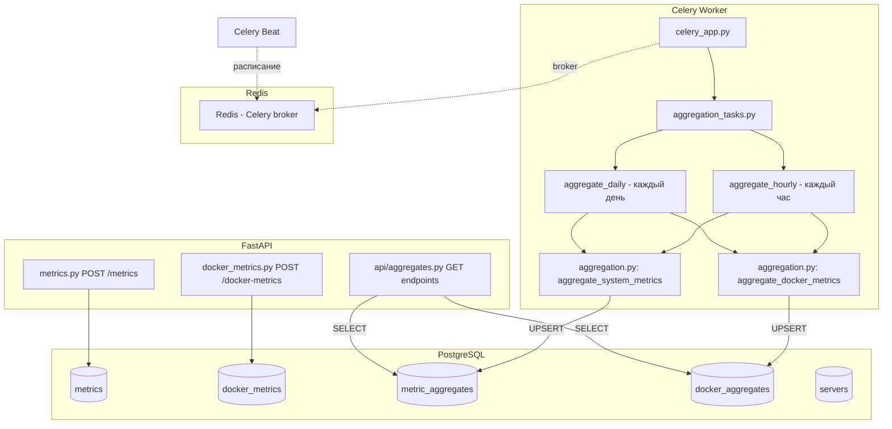
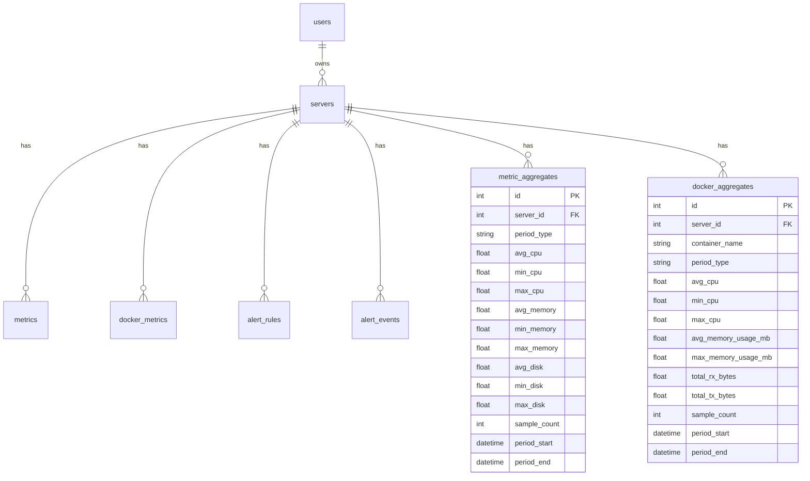

# Stage 6 — Агрегация метрик: Детальный план

## Обзор

Stage 6 добавляет систему агрегации метрик в PulseWatch: сырые системные и Docker-метрики агрегируются за часовые и дневные периоды с помощью Celery-задач, агрегированные данные хранятся в двух новых таблицах (`metric_aggregates`, `docker_aggregates`), а API предоставляет эндпоинты для получения агрегированной статистики. Подход UPSERT обеспечивает идемпотентность — повторный запуск задачи за тот же период обновляет существующий агрегат.

---

## 1. Архитектурная диаграмма



---

## 2. Модели БД

### 2.1 MetricAggregate — `app/models/metric_aggregate.py`

Агрегированные системные метрики за период.

| Поле | Тип | Ограничения | Описание |
|------|-----|-------------|----------|
| `id` | `int` | PK, autoincrement | |
| `server_id` | `int` | FK → `servers.id`, NOT NULL | Целевой сервер |
| `period_type` | `str` | NOT NULL, Enum: `hourly` / `daily` | Тип периода |
| `avg_cpu` | `float` | NOT NULL | Средний CPU за период |
| `min_cpu` | `float` | NOT NULL | Минимальный CPU |
| `max_cpu` | `float` | NOT NULL | Максимальный CPU |
| `avg_memory` | `float` | NOT NULL | Средняя память |
| `min_memory` | `float` | NOT NULL | Минимальная память |
| `max_memory` | `float` | NOT NULL | Максимальная память |
| `avg_disk` | `float` | NOT NULL | Средний диск |
| `min_disk` | `float` | NOT NULL | Минимальный диск |
| `max_disk` | `float` | NOT NULL | Максимальный диск |
| `sample_count` | `int` | NOT NULL | Количество исходных точек |
| `period_start` | `datetime` | NOT NULL, DateTime с tz | Начало периода |
| `period_end` | `datetime` | NOT NULL, DateTime с tz | Конец периода |

**Индексы:**
- `uq_metric_aggregates_server_period` — `UniqueConstraint(server_id, period_type, period_start)` — UPSERT-ключ
- `ix_metric_aggregates_period_start` на `period_start` — диапазонные запросы

```python
# app/models/metric_aggregate.py
from datetime import datetime
from enum import Enum as PyEnum

from sqlalchemy import DateTime, Enum, Float, ForeignKey, Index, Integer, UniqueConstraint, func
from sqlalchemy.orm import Mapped, mapped_column

from app.database import Base


class PeriodType(str, PyEnum):
    hourly = "hourly"
    daily = "daily"


class MetricAggregate(Base):
    __tablename__ = "metric_aggregates"

    id: Mapped[int] = mapped_column(Integer, primary_key=True, autoincrement=True)
    server_id: Mapped[int] = mapped_column(
        Integer, ForeignKey("servers.id", ondelete="CASCADE"), nullable=False
    )
    period_type: Mapped[str] = mapped_column(Enum(PeriodType), nullable=False)
    avg_cpu: Mapped[float] = mapped_column(Float, nullable=False)
    min_cpu: Mapped[float] = mapped_column(Float, nullable=False)
    max_cpu: Mapped[float] = mapped_column(Float, nullable=False)
    avg_memory: Mapped[float] = mapped_column(Float, nullable=False)
    min_memory: Mapped[float] = mapped_column(Float, nullable=False)
    max_memory: Mapped[float] = mapped_column(Float, nullable=False)
    avg_disk: Mapped[float] = mapped_column(Float, nullable=False)
    min_disk: Mapped[float] = mapped_column(Float, nullable=False)
    max_disk: Mapped[float] = mapped_column(Float, nullable=False)
    sample_count: Mapped[int] = mapped_column(Integer, nullable=False)
    period_start: Mapped[datetime] = mapped_column(DateTime(timezone=True), nullable=False)
    period_end: Mapped[datetime] = mapped_column(DateTime(timezone=True), nullable=False)

    __table_args__ = (
        UniqueConstraint(
            "server_id", "period_type", "period_start",
            name="uq_metric_aggregates_server_period",
        ),
        Index("ix_metric_aggregates_period_start", "period_start"),
    )
```

### 2.2 DockerAggregate — `app/models/docker_aggregate.py`

Агрегированные Docker-метрики за период по контейнерам.

| Поле | Тип | Ограничения | Описание |
|------|-----|-------------|----------|
| `id` | `int` | PK, autoincrement | |
| `server_id` | `int` | FK → `servers.id`, NOT NULL | Целевой сервер |
| `container_name` | `str` | NOT NULL | Имя контейнера |
| `period_type` | `str` | NOT NULL, Enum: `hourly` / `daily` | Тип периода |
| `avg_cpu` | `float` | NOT NULL | Средний CPU |
| `min_cpu` | `float` | NOT NULL | Минимальный CPU |
| `max_cpu` | `float` | NOT NULL | Максимальный CPU |
| `avg_memory_usage_mb` | `float` | NOT NULL | Среднее потребление памяти |
| `max_memory_usage_mb` | `float` | NOT NULL | Пиковое потребление памяти |
| `total_rx_bytes` | `float` | NOT NULL, default=0 | Суммарно получено байт (заглушка, пока нет в сырых данных) |
| `total_tx_bytes` | `float` | NOT NULL, default=0 | Суммарно отправлено байт (заглушка) |
| `sample_count` | `int` | NOT NULL | Количество исходных точек |
| `period_start` | `datetime` | NOT NULL, DateTime с tz | Начало периода |
| `period_end` | `datetime` | NOT NULL, DateTime с tz | Конец периода |

> **Примечание:** Текущая модель `DockerMetric` не содержит полей `network_rx_bytes` / `network_tx_bytes`. Поля `total_rx_bytes` и `total_tx_bytes` зарезервированы на будущее с default=0. Если сетевые метрики будут добавлены в `DockerMetric` позже, агрегация будет расширена.

**Индексы:**
- `uq_docker_aggregates_container_period` — `UniqueConstraint(server_id, container_name, period_type, period_start)` — UPSERT-ключ
- `ix_docker_aggregates_period_start` на `period_start`

```python
# app/models/docker_aggregate.py
from datetime import datetime

from sqlalchemy import DateTime, Enum, Float, ForeignKey, Index, Integer, String, UniqueConstraint
from sqlalchemy.orm import Mapped, mapped_column

from app.database import Base
from app.models.metric_aggregate import PeriodType


class DockerAggregate(Base):
    __tablename__ = "docker_aggregates"

    id: Mapped[int] = mapped_column(Integer, primary_key=True, autoincrement=True)
    server_id: Mapped[int] = mapped_column(
        Integer, ForeignKey("servers.id", ondelete="CASCADE"), nullable=False
    )
    container_name: Mapped[str] = mapped_column(String(255), nullable=False)
    period_type: Mapped[str] = mapped_column(Enum(PeriodType), nullable=False)
    avg_cpu: Mapped[float] = mapped_column(Float, nullable=False)
    min_cpu: Mapped[float] = mapped_column(Float, nullable=False)
    max_cpu: Mapped[float] = mapped_column(Float, nullable=False)
    avg_memory_usage_mb: Mapped[float] = mapped_column(Float, nullable=False)
    max_memory_usage_mb: Mapped[float] = mapped_column(Float, nullable=False)
    total_rx_bytes: Mapped[float] = mapped_column(Float, nullable=False, default=0)
    total_tx_bytes: Mapped[float] = mapped_column(Float, nullable=False, default=0)
    sample_count: Mapped[int] = mapped_column(Integer, nullable=False)
    period_start: Mapped[datetime] = mapped_column(DateTime(timezone=True), nullable=False)
    period_end: Mapped[datetime] = mapped_column(DateTime(timezone=True), nullable=False)

    __table_args__ = (
        UniqueConstraint(
            "server_id", "container_name", "period_type", "period_start",
            name="uq_docker_aggregates_container_period",
        ),
        Index("ix_docker_aggregates_period_start", "period_start"),
    )
```

### ER-диаграмма (обновлённая)



---

## 3. Pydantic-схемы

Новый файл `app/schemas/aggregate.py`:

```python
# app/schemas/aggregate.py
from datetime import datetime
from pydantic import BaseModel, ConfigDict, Field

from app.models.metric_aggregate import PeriodType


# --- MetricAggregate schemas ---

class MetricAggregateRead(BaseModel):
    """Агрегированные системные метрики за период."""
    id: int
    server_id: int
    period_type: PeriodType
    avg_cpu: float
    min_cpu: float
    max_cpu: float
    avg_memory: float
    min_memory: float
    max_memory: float
    avg_disk: float
    min_disk: float
    max_disk: float
    sample_count: int
    period_start: datetime
    period_end: datetime

    model_config = ConfigDict(from_attributes=True)


# --- DockerAggregate schemas ---

class DockerAggregateRead(BaseModel):
    """Агрегированные Docker-метрики за период."""
    id: int
    server_id: int
    container_name: str
    period_type: PeriodType
    avg_cpu: float
    min_cpu: float
    max_cpu: float
    avg_memory_usage_mb: float
    max_memory_usage_mb: float
    total_rx_bytes: float
    total_tx_bytes: float
    sample_count: int
    period_start: datetime
    period_end: datetime

    model_config = ConfigDict(from_attributes=True)


# --- Query parameters ---

class AggregateQueryParams(BaseModel):
    """Общие параметры запроса агрегированных данных."""
    period: PeriodType = Field(default=PeriodType.hourly)
    from_date: datetime = Field(..., description="Начало диапазона ISO 8601")
    to_date: datetime = Field(..., description="Конец диапазона ISO 8601")
```

---

## 4. Сервис агрегации — `app/services/aggregation.py`

Логика агрегации сырых метрик в агрегированные записи. Использует SQLAlchemy `func.avg()`, `func.min()`, `func.max()`, `func.count()`.

```python
# app/services/aggregation.py
from datetime import datetime, timezone

from sqlalchemy import select, func, and_
from sqlalchemy.dialects.postgresql import insert
from sqlalchemy.ext.asyncio import AsyncSession

from app.models.metric import Metric
from app.models.docker_metric import DockerMetric
from app.models.metric_aggregate import MetricAggregate, PeriodType
from app.models.docker_aggregate import DockerAggregate


async def aggregate_system_metrics(
    db: AsyncSession,
    server_id: int,
    period_start: datetime,
    period_end: datetime,
    period_type: PeriodType,
) -> MetricAggregate | None:
    """
    Агрегирует сырые Metric за [period_start, period_end) в MetricAggregate.
    Использует PostgreSQL INSERT ... ON CONFLICT DO UPDATE (UPSERT).

    Возвращает созданный/обновлённый агрегат или None, если нет сырых данных.
    """
    # Запрос агрегации из сырых метрик
    result = await db.execute(
        select(
            func.avg(Metric.cpu_percent).label("avg_cpu"),
            func.min(Metric.cpu_percent).label("min_cpu"),
            func.max(Metric.cpu_percent).label("max_cpu"),
            func.avg(Metric.memory_percent).label("avg_memory"),
            func.min(Metric.memory_percent).label("min_memory"),
            func.max(Metric.memory_percent).label("max_memory"),
            func.avg(Metric.disk_percent).label("avg_disk"),
            func.min(Metric.disk_percent).label("min_disk"),
            func.max(Metric.disk_percent).label("max_disk"),
            func.count(Metric.id).label("sample_count"),
        ).where(
            Metric.server_id == server_id,
            Metric.collected_at >= period_start,
            Metric.collected_at < period_end,
        )
    )
    row = result.one()

    # Если нет данных за период — возвращаем None
    if row.sample_count == 0:
        return None

    # UPSERT через PostgreSQL insert с on_conflict_do_update
    stmt = insert(MetricAggregate).values(
        server_id=server_id,
        period_type=period_type,
        avg_cpu=row.avg_cpu,
        min_cpu=row.min_cpu,
        max_cpu=row.max_cpu,
        avg_memory=row.avg_memory,
        min_memory=row.min_memory,
        max_memory=row.max_memory,
        avg_disk=row.avg_disk,
        min_disk=row.min_disk,
        max_disk=row.max_disk,
        sample_count=row.sample_count,
        period_start=period_start,
        period_end=period_end,
    )

    # При конфликте по (server_id, period_type, period_start) — обновляем
    stmt = stmt.on_conflict_do_update(
        constraint="uq_metric_aggregates_server_period",
        set_={
            "avg_cpu": stmt.excluded.avg_cpu,
            "min_cpu": stmt.excluded.min_cpu,
            "max_cpu": stmt.excluded.max_cpu,
            "avg_memory": stmt.excluded.avg_memory,
            "min_memory": stmt.excluded.min_memory,
            "max_memory": stmt.excluded.max_memory,
            "avg_disk": stmt.excluded.avg_disk,
            "min_disk": stmt.excluded.min_disk,
            "max_disk": stmt.excluded.max_disk,
            "sample_count": stmt.excluded.sample_count,
            "period_end": stmt.excluded.period_end,
        },
    )

    await db.execute(stmt)
    await db.commit()

    # Возвращаем агрегат
    agg_result = await db.execute(
        select(MetricAggregate).where(
            MetricAggregate.server_id == server_id,
            MetricAggregate.period_type == period_type,
            MetricAggregate.period_start == period_start,
        )
    )
    return agg_result.scalar_one_or_none()


async def aggregate_docker_metrics(
    db: AsyncSession,
    server_id: int,
    period_start: datetime,
    period_end: datetime,
    period_type: PeriodType,
) -> list[DockerAggregate]:
    """
    Агрегирует сырые DockerMetric за [period_start, period_end) в DockerAggregate.
    Группировка по container_name. UPSERT для каждого контейнера.

    Возвращает список созданных/обновлённых агрегатов.
    """
    # Запрос агрегации с группировкой по container_name
    result = await db.execute(
        select(
            DockerMetric.container_name,
            func.avg(DockerMetric.cpu_percent).label("avg_cpu"),
            func.min(DockerMetric.cpu_percent).label("min_cpu"),
            func.max(DockerMetric.cpu_percent).label("max_cpu"),
            func.avg(DockerMetric.memory_usage_mb).label("avg_memory_usage_mb"),
            func.max(DockerMetric.memory_usage_mb).label("max_memory_usage_mb"),
            func.count(DockerMetric.id).label("sample_count"),
        ).where(
            DockerMetric.server_id == server_id,
            DockerMetric.collected_at >= period_start,
            DockerMetric.collected_at < period_end,
        ).group_by(DockerMetric.container_name)
    )
    rows = result.all()

    if not rows:
        return []

    aggregates = []
    for row in rows:
        stmt = insert(DockerAggregate).values(
            server_id=server_id,
            container_name=row.container_name,
            period_type=period_type,
            avg_cpu=row.avg_cpu,
            min_cpu=row.min_cpu,
            max_cpu=row.max_cpu,
            avg_memory_usage_mb=row.avg_memory_usage_mb,
            max_memory_usage_mb=row.max_memory_usage_mb,
            total_rx_bytes=0,  # Зарезервировано
            total_tx_bytes=0,  # Зарезервировано
            sample_count=row.sample_count,
            period_start=period_start,
            period_end=period_end,
        )

        stmt = stmt.on_conflict_do_update(
            constraint="uq_docker_aggregates_container_period",
            set_={
                "avg_cpu": stmt.excluded.avg_cpu,
                "min_cpu": stmt.excluded.min_cpu,
                "max_cpu": stmt.excluded.max_cpu,
                "avg_memory_usage_mb": stmt.excluded.avg_memory_usage_mb,
                "max_memory_usage_mb": stmt.excluded.max_memory_usage_mb,
                "sample_count": stmt.excluded.sample_count,
                "period_end": stmt.excluded.period_end,
            },
        )

        await db.execute(stmt)
        aggregates.append(row.container_name)

    await db.commit()

    # Возвращаем созданные агрегаты
    agg_result = await db.execute(
        select(DockerAggregate).where(
            DockerAggregate.server_id == server_id,
            DockerAggregate.period_type == period_type,
            DockerAggregate.period_start == period_start,
        )
    )
    return list(agg_result.scalars().all())


async def aggregate_all_servers(
    db: AsyncSession,
    period_start: datetime,
    period_end: datetime,
    period_type: PeriodType,
) -> dict:
    """
    Запускает агрегацию для всех активных серверов.
    Используется Celery-задачами.
    Возвращает отчёт: {"servers_processed": N, "system_aggregates": M, "docker_aggregates": K}
    """
    from app.models.server import Server

    # Получаем все активные серверы
    result = await db.execute(
        select(Server).where(Server.is_active == True)
    )
    servers = result.scalars().all()

    system_count = 0
    docker_count = 0

    for server in servers:
        # Агрегация системных метрик
        agg = await aggregate_system_metrics(
            db, server.id, period_start, period_end, period_type
        )
        if agg is not None:
            system_count += 1

        # Агрегация Docker-метрик
        docker_aggs = await aggregate_docker_metrics(
            db, server.id, period_start, period_end, period_type
        )
        docker_count += len(docker_aggs)

    return {
        "servers_processed": len(servers),
        "system_aggregates": system_count,
        "docker_aggregates": docker_count,
    }
```

---

## 5. Celery конфигурация — `app/tasks/`

### 5.1 `app/tasks/celery_app.py`

Celery-приложение с Redis в качестве брокера и beat-расписанием.

```python
# app/tasks/celery_app.py
from celery import Celery
from app.config import settings

celery_app = Celery(
    "pulsewatch",
    broker=f"redis://{settings.redis_host}:{settings.redis_port}/1",
    backend=f"redis://{settings.redis_host}:{settings.redis_port}/2",
)

celery_app.conf.update(
    # Серийализатор
    task_serializer="json",
    accept_content=["json"],
    result_serializer="json",

    # Часовой пояс
    timezone="UTC",
    enable_utc=True,

    # Beat-расписание
    beat_schedule={
        "aggregate-hourly-metrics": {
            "task": "app.tasks.aggregation_tasks.aggregate_hourly",
            "schedule": crontab(minute=5),  # На 5-й минуте каждого часа
        },
        "aggregate-daily-metrics": {
            "task": "app.tasks.aggregation_tasks.aggregate_daily",
            "schedule": crontab(hour=0, minute=15),  # В 00:15 UTC каждый день
        },
    },
)

# Автообнаружение задач
celery_app.autodiscover_tasks(["app.tasks"])
```

> **Важно:** Celery использует `/1` для broker и `/2` для backend, чтобы не конфликтовать с Redis Pub/Sub из Stage 4 (который использует `/0`).

### 5.2 `app/tasks/aggregation_tasks.py`

Задачи агрегации, запускаемые Celery Beat.

```python
# app/tasks/aggregation_tasks.py
from datetime import datetime, timedelta, timezone

from celery import shared_task
from celery.utils.log import get_task_logger

from app.tasks.celery_app import celery_app
from app.services.aggregation import aggregate_all_servers

logger = get_task_logger(__name__)


def _get_async_session():
    """Создаёт AsyncSession для использования в Celery-задачах."""
    from app.database import async_session
    return async_session()


@celery_app.task(name="app.tasks.aggregation_tasks.aggregate_hourly")
def aggregate_hourly():
    """
    Агрегация метрик за предыдущий час.
    Запускается на 5-й минуте каждого часа.
    """
    now = datetime.now(timezone.utc)
    period_end = now.replace(minute=0, second=0, microsecond=0)
    period_start = period_end - timedelta(hours=1)

    logger.info(
        f"Starting hourly aggregation: {period_start} - {period_end}"
    )

    import asyncio
    async def _run():
        async with _get_async_session() as db:
            result = await aggregate_all_servers(
                db, period_start, period_end, "hourly"
            )
            return result

    result = asyncio.run(_run())
    logger.info(f"Hourly aggregation complete: {result}")
    return result


@celery_app.task(name="app.tasks.aggregation_tasks.aggregate_daily")
def aggregate_daily():
    """
    Агрегация метрик за предыдущий день.
    Запускается в 00:15 UTC каждый день.
    """
    now = datetime.now(timezone.utc)
    period_end = now.replace(hour=0, minute=0, second=0, microsecond=0)
    period_start = period_end - timedelta(days=1)

    logger.info(
        f"Starting daily aggregation: {period_start} - {period_end}"
    )

    import asyncio
    async def _run():
        async with _get_async_session() as db:
            result = await aggregate_all_servers(
                db, period_start, period_end, "daily"
            )
            return result

    result = asyncio.run(_run())
    logger.info(f"Daily aggregation complete: {result}")
    return result
```

### 5.3 `app/tasks/heartbeat_tasks.py`

Heartbeat-мониторинг — опциональная задача для проверки доступности серверов.

```python
# app/tasks/heartbeat_tasks.py
from datetime import datetime, timedelta, timezone

from celery.utils.log import get_task_logger

from app.tasks.celery_app import celery_app

logger = get_task_logger(__name__)


@celery_app.task(name="app.tasks.heartbeat_tasks.check_server_heartbeats")
def check_server_heartbeats():
    """
    Проверяет серверы, от которых давно не было метрик.
    Помечает серверы как is_active=False, если last_seen_at старше threshold.
    """
    threshold_minutes = 30

    import asyncio
    from sqlalchemy import select, update
    from app.models.server import Server
    from app.database import async_session

    async def _run():
        async with async_session() as db:
            cutoff = datetime.now(timezone.utc) - timedelta(minutes=threshold_minutes)

            result = await db.execute(
                update(Server)
                .where(
                    Server.is_active == True,
                    Server.last_seen_at != None,
                    Server.last_seen_at < cutoff,
                )
                .values(is_active=False)
                .returning(Server.id, Server.name)
            )
            inactive = result.all()
            await db.commit()

            if inactive:
                for server_id, name in inactive:
                    logger.warning(
                        f"Server '{name}' (id={server_id}) marked inactive: "
                        f"no data for {threshold_minutes} min"
                    )

            return {"marked_inactive": len(inactive)}

    result = asyncio.run(_run())
    logger.info(f"Heartbeat check complete: {result}")
    return result
```

> **Beat-расписание для heartbeat** — добавить в `celery_app.conf.beat_schedule`:
> ```python
> "check-server-heartbeats": {
>     "task": "app.tasks.heartbeat_tasks.check_server_heartbeats",
>     "schedule": crontab(minute="*/10"),  # Каждые 10 минут
> },
> ```

---

## 6. API-эндпоинты — `app/api/aggregates.py`

### 6.1 Сигнатуры эндпоинтов

| Метод | Путь | Описание | Auth |
|-------|------|----------|------|
| `GET` | `/servers/{server_id}/metrics/aggregate` | Агрегированные системные метрики | JWT + owner |
| `GET` | `/servers/{server_id}/docker-metrics/aggregate` | Агрегированные Docker-метрики | JWT + owner |

### 6.2 Детализация

```python
# app/api/aggregates.py
from fastapi import APIRouter, Depends, HTTPException, Query, status
from sqlalchemy import select
from sqlalchemy.ext.asyncio import AsyncSession

from app.api.deps import get_current_user
from app.database import get_db
from app.models.user import User
from app.models.server import Server
from app.models.metric_aggregate import MetricAggregate, PeriodType
from app.models.docker_aggregate import DockerAggregate
from app.schemas.aggregate import MetricAggregateRead, DockerAggregateRead

router = APIRouter()


async def _verify_server_ownership(
    server_id: int, user: User, db: AsyncSession
) -> Server:
    """Проверяет, что сервер принадлежит пользователю."""
    server = (await db.execute(
        select(Server).where(
            Server.id == server_id, Server.owner_id == user.id
        )
    )).scalar_one_or_none()
    if server is None:
        raise HTTPException(status_code=404, detail="Server not found")
    return server


@router.get(
    "/{server_id}/metrics/aggregate",
    response_model=list[MetricAggregateRead],
)
async def get_system_aggregates(
    server_id: int,
    period: PeriodType = Query(default=PeriodType.hourly),
    from_date: datetime = Query(..., alias="from"),
    to_date: datetime = Query(..., alias="to"),
    current_user: User = Depends(get_current_user),
    db: AsyncSession = Depends(get_db),
):
    """
    Получить агрегированные системные метрики за период.
    Параметры:
      - period: hourly | daily (default: hourly)
      - from: начало диапазона (ISO 8601)
      - to: конец диапазона (ISO 8601)
    """
    await _verify_server_ownership(server_id, current_user, db)

    result = await db.execute(
        select(MetricAggregate).where(
            MetricAggregate.server_id == server_id,
            MetricAggregate.period_type == period,
            MetricAggregate.period_start >= from_date,
            MetricAggregate.period_end <= to_date,
        ).order_by(MetricAggregate.period_start.asc())
    )
    return result.scalars().all()


@router.get(
    "/{server_id}/docker-metrics/aggregate",
    response_model=list[DockerAggregateRead],
)
async def get_docker_aggregates(
    server_id: int,
    period: PeriodType = Query(default=PeriodType.hourly),
    from_date: datetime = Query(..., alias="from"),
    to_date: datetime = Query(..., alias="to"),
    container_name: str | None = Query(default=None),
    current_user: User = Depends(get_current_user),
    db: AsyncSession = Depends(get_db),
):
    """
    Получить агрегированные Docker-метрики за период.
    Параметры:
      - period: hourly | daily (default: hourly)
      - from: начало диапазона (ISO 8601)
      - to: конец диапазона (ISO 8601)
      - container_name: опциональный фильтр по контейнеру
    """
    await _verify_server_ownership(server_id, current_user, db)

    query = select(DockerAggregate).where(
        DockerAggregate.server_id == server_id,
        DockerAggregate.period_type == period,
        DockerAggregate.period_start >= from_date,
        DockerAggregate.period_end <= to_date,
    )
    if container_name is not None:
        query = query.where(DockerAggregate.container_name == container_name)

    query = query.order_by(DockerAggregate.period_start.asc())
    result = await db.execute(query)
    return result.scalars().all()
```

> **Примечание:** Эндпоинты монтируются в `main.py` с префиксом `/servers` — полный путь будет `/servers/{server_id}/metrics/aggregate`. Либо можно вынести агрегатные эндпоинты в отдельный роутер с другим префиксом. Подробнее в разделе интеграции.

---

## 7. Точки интеграции

### 7.1 `app/main.py`

Зарегистрировать роутер агрегатов:

```python
from app.api.aggregates import router as aggregates_router
# ...
app.include_router(
    aggregates_router, prefix="/servers", tags=["aggregates"]
)
```

> Префикс `/servers` — так как эндпоинты содержат `{server_id}` в пути.

### 7.2 `app/config.py`

Добавить настройки Celery (опционально, можно использовать существующие `redis_host` / `redis_port`):

```python
# Добавить в класс Settings:
celery_broker_url: str = ""  # Если пусто — формируется из redis_host/redis_port
celery_result_backend: str = ""

@property
def celery_broker(self) -> str:
    if self.celery_broker_url:
        return self.celery_broker_url
    return f"redis://{self.redis_host}:{self.redis_port}/1"

@property
def celery_backend(self) -> str:
    if self.celery_result_backend:
        return self.celery_result_backend
    return f"redis://{self.redis_host}:{self.redis_port}/2"
```

### 7.3 `tests/conftest.py`

Добавить импорты новых моделей для регистрации в `Base.metadata`:

```python
from app.models.metric_aggregate import MetricAggregate  # noqa: F401
from app.models.docker_aggregate import DockerAggregate  # noqa: F401
```

### 7.4 `docker-compose.yml`

Добавить сервисы Celery worker и Celery beat:

```yaml
  celery_worker:
    build: .
    container_name: pulsewatch_celery_worker
    restart: unless-stopped
    depends_on:
      db:
        condition: service_healthy
      redis:
        condition: service_healthy
    environment:
      DB_USER: ${DB_USER}
      DB_PASSWORD: ${DB_PASSWORD}
      DB_HOST: db
      DB_PORT: 5432
      DB_NAME: ${DB_NAME}
      REDIS_HOST: redis
      REDIS_PORT: 6379
      SECRET_KEY: ${SECRET_KEY}
      ALGORITHM: ${ALGORITHM}
    command: celery -A app.tasks.celery_app:celery_app worker --loglevel=info

  celery_beat:
    build: .
    container_name: pulsewatch_celery_beat
    restart: unless-stopped
    depends_on:
      redis:
        condition: service_healthy
    environment:
      REDIS_HOST: redis
      REDIS_PORT: 6379
    command: celery -A app.tasks.celery_app:celery_app beat --loglevel=info
```

### 7.5 `pyproject.toml`

Добавить зависимость Celery:

```toml
dependencies = [
    # ... существующие ...
    "celery[redis]>=5.4.0",
]
```

### 7.6 `Dockerfile`

Файл уже собирает проект — изменений не требуется, так как `celery_worker` и `celery_beat` используют тот же образ с переопределённой `command`.

### 7.7 `.env.example`

Добавить переменные (если используются):

```
# Celery (опционально, по умолчанию берётся из Redis)
# CELERY_BROKER_URL=redis://redis:6379/1
# CELERY_RESULT_BACKEND=redis://redis:6379/2
```

---

## 8. Миграция Alembic

Создать миграцию `create_aggregate_tables.py`:

```python
"""create metric_aggregates and docker_aggregates tables

Revision ID: xxx
Revises: 7c818dce7bd1
Create Date: 2026-05-04
"""
from alembic import op
import sqlalchemy as sa


def upgrade() -> None:
    # Enum для period_type (повторно используется)
    period_type_enum = sa.Enum("hourly", "daily", name="periodtype")

    op.create_table(
        "metric_aggregates",
        sa.Column("id", sa.Integer(), autoincrement=True, nullable=False),
        sa.Column("server_id", sa.Integer(), nullable=False),
        sa.Column("period_type", period_type_enum, nullable=False),
        sa.Column("avg_cpu", sa.Float(), nullable=False),
        sa.Column("min_cpu", sa.Float(), nullable=False),
        sa.Column("max_cpu", sa.Float(), nullable=False),
        sa.Column("avg_memory", sa.Float(), nullable=False),
        sa.Column("min_memory", sa.Float(), nullable=False),
        sa.Column("max_memory", sa.Float(), nullable=False),
        sa.Column("avg_disk", sa.Float(), nullable=False),
        sa.Column("min_disk", sa.Float(), nullable=False),
        sa.Column("max_disk", sa.Float(), nullable=False),
        sa.Column("sample_count", sa.Integer(), nullable=False),
        sa.Column("period_start", sa.DateTime(timezone=True), nullable=False),
        sa.Column("period_end", sa.DateTime(timezone=True), nullable=False),
        sa.ForeignKeyConstraint(["server_id"], ["servers.id"], ondelete="CASCADE"),
        sa.PrimaryKeyConstraint("id"),
        sa.UniqueConstraint(
            "server_id", "period_type", "period_start",
            name="uq_metric_aggregates_server_period",
        ),
    )
    op.create_index(
        "ix_metric_aggregates_period_start",
        "metric_aggregates",
        ["period_start"],
    )

    op.create_table(
        "docker_aggregates",
        sa.Column("id", sa.Integer(), autoincrement=True, nullable=False),
        sa.Column("server_id", sa.Integer(), nullable=False),
        sa.Column("container_name", sa.String(255), nullable=False),
        sa.Column("period_type", period_type_enum, nullable=False),
        sa.Column("avg_cpu", sa.Float(), nullable=False),
        sa.Column("min_cpu", sa.Float(), nullable=False),
        sa.Column("max_cpu", sa.Float(), nullable=False),
        sa.Column("avg_memory_usage_mb", sa.Float(), nullable=False),
        sa.Column("max_memory_usage_mb", sa.Float(), nullable=False),
        sa.Column("total_rx_bytes", sa.Float(), nullable=False, server_default="0"),
        sa.Column("total_tx_bytes", sa.Float(), nullable=False, server_default="0"),
        sa.Column("sample_count", sa.Integer(), nullable=False),
        sa.Column("period_start", sa.DateTime(timezone=True), nullable=False),
        sa.Column("period_end", sa.DateTime(timezone=True), nullable=False),
        sa.ForeignKeyConstraint(["server_id"], ["servers.id"], ondelete="CASCADE"),
        sa.PrimaryKeyConstraint("id"),
        sa.UniqueConstraint(
            "server_id", "container_name", "period_type", "period_start",
            name="uq_docker_aggregates_container_period",
        ),
    )
    op.create_index(
        "ix_docker_aggregates_period_start",
        "docker_aggregates",
        ["period_start"],
    )


def downgrade() -> None:
    op.drop_table("docker_aggregates")
    op.drop_table("metric_aggregates")
    op.execute("DROP TYPE IF EXISTS periodtype")
```

---

## 9. План тестов

### 9.1 Файлы тестов

| Файл | Описание |
|------|----------|
| `tests/test_aggregation.py` | Тесты сервиса агрегации |
| `tests/test_aggregates_api.py` | Тесты API-эндпоинтов |

### 9.2 Тест-кейсы `tests/test_aggregation.py`

**Сервис агрегации (юнит-тесты с БД):**

1. `test_aggregate_system_metrics_basic` — создать 3 метрики за 1 час, агрегировать, проверить avg/min/max/sample_count
2. `test_aggregate_system_metrics_no_data` — агрегация за период без данных → возвращает None
3. `test_aggregate_system_metrics_upsert` — дважды запустить агрегацию за тот же период → данные обновляются (не дублируются)
4. `test_aggregate_system_metrics_period_boundary` — метрика точно на границе `period_start` включается, на `period_end` — нет
5. `test_aggregate_system_metrics_multiple_servers` — метрики двух серверов не смешиваются

6. `test_aggregate_docker_metrics_basic` — создать Docker-метрики для 2 контейнеров, агрегировать, проверить группировку
7. `test_aggregate_docker_metrics_no_data` — нет данных → пустой список
8. `test_aggregate_docker_metrics_upsert` — UPSERT для Docker-агрегатов
9. `test_aggregate_docker_metrics_single_container` — агрегация для одного контейнера

10. `test_aggregate_all_servers` — создать 2 сервера с метриками, вызвать `aggregate_all_servers`, проверить отчёт

### 9.3 Тест-кейсы `tests/test_aggregates_api.py`

**API-эндпоинты:**

11. `test_get_system_aggregates_hourly` — создать метрики, агрегировать через сервис, получить через API
12. `test_get_system_aggregates_daily` — аналогично для дневного периода
13. `test_get_system_aggregates_date_range` — фильтр по from/to
14. `test_get_system_aggregates_empty` — нет агрегатов за период → 200 с пустым списком
15. `test_get_system_aggregates_server_not_found` — несуществующий сервер, 404
16. `test_get_system_aggregates_unauthorized` — без токена, 401
17. `test_get_system_aggregates_other_user` — чужой сервер, 404

18. `test_get_docker_aggregates_basic` — базовый запрос агрегатов Docker
19. `test_get_docker_aggregates_filter_container` — фильтр по container_name
20. `test_get_docker_aggregates_date_range` — фильтр по from/to
21. `test_get_docker_aggregates_unauthorized` — без токена, 401

### 9.4 Вспомогательные фикстуры

```python
# Добавить в tests/conftest.py или в файл тестов

@pytest_asyncio.fixture
async def server_with_metrics(client, auth_headers):
    """Создаёт сервер и 3 системные метрики за последний час."""
    # Создаём сервер
    resp = await client.post(
        "/servers/register",
        json={"name": "test-server"},
        headers=auth_headers,
    )
    server = resp.json()

    # Отправляем метрики от имени агента (через API key)
    # ... (аналогично tests/test_metrics.py)

    return server
```

### 9.5 Примечание по Celery-задачам

Celery-задачи тестируются на уровне **интеграционных тестов**: вызываем функцию напрямую (не через `.delay()`), чтобы избежать необходимости поднимать Redis и Celery worker в тестовом окружении. Каждая задача внутри вызывает `asyncio.run()`, что работает корректно в синхронном контексте Celery worker'а.

Для unit-тестов предпочтительнее тестировать `aggregate_system_metrics` / `aggregate_docker_metrics` напрямую через `AsyncSession`, а не через Celery-задачи.

---

## 10. Сводка файлов для создания/изменения

### Новые файлы — заполнить заглушки

| Файл | Действие |
|------|----------|
| `app/models/metric_aggregate.py` | Модель MetricAggregate + PeriodType enum |
| `app/models/docker_aggregate.py` | Модель DockerAggregate |
| `app/schemas/aggregate.py` | Pydantic-схемы для агрегатов |
| `app/services/aggregation.py` | Логика агрегации (заполнить заглушку) |
| `app/tasks/celery_app.py` | Celery-приложение (заполнить заглушку) |
| `app/tasks/aggregation_tasks.py` | Задачи aggregate_hourly / aggregate_daily (заполнить заглушку) |
| `app/tasks/heartbeat_tasks.py` | Heartbeat-мониторинг (заполнить заглушку) |
| `app/api/aggregates.py` | API-эндпоинты для агрегированных данных |
| `alembic/versions/xxx_create_aggregate_tables.py` | Миграция |
| `tests/test_aggregation.py` | Тесты сервиса агрегации |
| `tests/test_aggregates_api.py` | Тесты API-эндпоинтов |

### Существующие файлы — изменения

| Файл | Изменение |
|------|-----------|
| `app/main.py` | Зарегистрировать `aggregates_router` |
| `app/config.py` | Добавить `celery_broker` / `celery_backend` properties (опционально) |
| `app/database.py` | Без изменений — `async_session` уже доступен для Celery |
| `tests/conftest.py` | Добавить импорты `MetricAggregate`, `DockerAggregate` |
| `docker-compose.yml` | Добавить сервисы `celery_worker` и `celery_beat` |
| `pyproject.toml` | Добавить `celery[redis]` в dependencies |
| `.env.example` | Добавить опциональные переменные Celery |
| `Dockerfile` | Без изменений (переиспользуется для worker/beat) |

---

## 11. Порядок реализации

1. **Зависимости** — добавить `celery[redis]` в `pyproject.toml`, выполнить `uv sync`
2. **Модели** — `metric_aggregate.py`, `docker_aggregate.py`
3. **Обновить** `tests/conftest.py` — импорт новых моделей
4. **Миграция** — создать Alembic migration
5. **Схемы** — `app/schemas/aggregate.py`
6. **Сервис** — `app/services/aggregation.py`
7. **Celery** — `celery_app.py`, `aggregation_tasks.py`, `heartbeat_tasks.py`
8. **API** — `app/api/aggregates.py`, зарегистрировать в `main.py`
9. **Docker** — обновить `docker-compose.yml` (worker + beat)
10. **Конфигурация** — обновить `config.py`, `.env.example`
11. **Тесты** — `tests/test_aggregation.py`, `tests/test_aggregates_api.py`

---

## 12. Ключевые технические решения

| Решение | Обоснование |
|---------|-------------|
| UPSERT через `INSERT ON CONFLICT UPDATE` | Идемпотентность — повторный запуск задачи не создаёт дубликатов |
| `UniqueConstraint` на `(server_id, period_type, period_start)` | Естественный ключ для UPSERT |
| Celery worker — отдельный процесс | Не нагружает FastAPI; горизонтально масштабируется |
| `asyncio.run()` в Celery-задачах | Celery sync + SQLAlchemy async; `asyncpg` корректно работает в этом режиме |
| Redis DB `/1` для broker, `/2` для backend | Изоляция от Pub/Sub на `/0` из Stage 4 |
| `total_rx_bytes` / `total_tx_bytes` с default=0 | Зарезервированы для будущего расширения `DockerMetric` |
| `period_end` — exclusive граница | Стандартный подход: `[period_start, period_end)` — метрика на границе часа попадает в следующий период |
